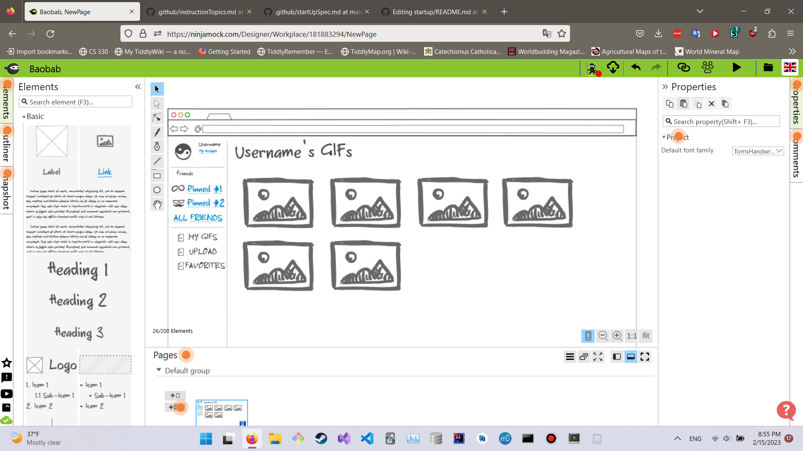

# startup
CS 260 Web Programming Project.
------------------------
Baobab
Baobab is a website for hosting GIFs. It's similar to Giphy, but with a focus on sharing GIFs with friends rather than uploading them for strangers.
Features:
- Upload GIFs to the website
- Add friends
- View your own GIFs and your friends'
- Pin certain friends' pages to your hotbar
- Favorite GIFs to your favorites page

